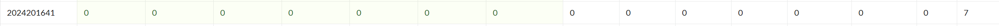

# bomblab 报告

姓名：黄子谦

学号：2024201641

| 总分 | phase_1 | phase_2 | phase_3 | phase_4 | phase_5 | phase_6 | secret_phase |
| --------- | ------------- | ------------- | ------------- | ----------------- |-----------|-----------|-----------|
| 7        | 1            | 1            | 1            | 1 |1  |1  |1  |


scoreboard 截图：



<!-- TODO: 用一个scoreboard的截图，本地图片，放到 imgs 文件夹下，不要用这个 github，pandoc 解析可能有问题 -->

## 解题报告

<!-- 对你拆掉的每个phase进行分析，并写出你得出答案的历程 -->
<!-- 如果能用伪代码还原题目源代码最佳（不属于先前提到的大段代码），语言描述自己的分析也可，每道题目的图片不建议超过两张 -->

### phase_1

```c
- What is the most used language in programming? - Profanity.
```
本题思路比较简单，在助教的示例视频中亦有提及（doge），只需打开GDB，找到题目所给地址的内容并输出即可


### phase_2

```c
1172604 1816050 887556 1348318
```
本题代码大致如下
```c
void phase_2() {
    
    int input[4];  
    int result[6]; 
    
    for (int i = 0; i < 2; i++) {
        for (int j = 0; j < 2; j++) {
            int sum = 0;
            for (int k = 0; k < 3; k++) {
                sum += matA[i][k] * matB[k][j];
            }
            result[i*2 + j] = sum; 
        }
    }
}
```
本题难点个人认为在于如何发现这是矩阵乘法并确定尺寸。发现矩阵乘法某种程度上是一种直觉：代码中出现了乘法与三层嵌套循环，被CatheLab折磨过头的我第一反应就是矩阵乘法。之后确定尺寸：方法类似期中倒数第二大题，将每次乘法的边缘情况分析可得尺寸 2，3.
当然，不确定尺寸也没关系，只要在每次将sum存入re时打个断点及时观察%eax的值就可以了...

### phase_3
```c
0 97
```
本题代码大致如下
```c
void phase_3() {
    
   if (sscanf(input_string, "%d %d", &input_a, &input_b) <= 1) {
        explode_bomb();
    }
    
    if (input_a > 7) {
        explode_bomb();
    }
switch(input_a){
case_0:
    result = 0x1e1 - delta;
    break;
case_1:
    ...
case_2:
    ...
case_3:
    ...
case_4:
    ...
case_5:
    ...
case_6:
    ...
case_7:
    ...
}
}
```
本题确认输入就有点难，题目要求输入两个整数。分析时主要发现题目有显著的
```c
sub .....
jmp .....
```
代码块，并且预处理输入时有很明显的是否大于7的判定，之后把输入值作为跳转目的地的偏移量，这是最明显的swich-case函数特征。为了掩人耳目，题目中还增设了delta变量，来隐藏答案（或者说使答案不那么直接）。
但做题时无需纠结$\delta$，只需输入一个0-6的数和随便一个数，一直跟踪到比较时，记录另一个值（正解），然后从头再来就行了。

### phase_4
```c
31 AB
```


1.函数1是一个结构比较明显的递归，不做赘述，phase4主函数也明确参数为5，计算得31
2.函数2比较抽象复杂，花费了我不少时间，主要难点在于分支较多且参数复杂。这里以代码展示函数2的过程
```c
void func4_2(int n, int val, char a, char b, char c, char* output) {
    if (n == 1) {
        output[0] = a;
        output[1] = b;
        output[2] = '\0';
        return;
    }
    int temp = func4_1(n - 1);
    
    if (temp >= val) {
       
        func4_2(n - 1, val, a, c, b, output);
    } else {
        if (temp + 1 == val) {
            output[0] = a;
            output[1] = b;
            output[2] = '\0';
        } else {
            func4_2(n - 1, val - temp - 1, c, b, a, output);
        }
    }
}
```
当然了，从做题角度上讲，在确定函数2返回的就是两个字符的码后，直接找到两处ret并打断点，看最后栈里存的是什么也可以解出题目。
### phase_5
```c
82>768
```
本题代码大致如下
```c
void phase_5(char* input) {
    
    char transformed[7];  
    
    if (string_length(input) != 6) {
        explode_bomb();
    }
   
    char* table = ...;  
    for (int i = 0; i < 6; i++) {
        char c = input[i];
       
        //将字符转为有符号字节并加上0xf,取低4位作为索引 (相当于 c + 0xf) & 0xf
        int index = ((c + 0xf) & 0xf);
        //用索引从字符表中查找对应的字符
        transformed[i] = table[index];
    }
    transformed[6] = '\0';  
    
    char* target = ...; 
    if (strings_not_equal(transformed, target) != 0) {
        explode_bomb();
    }
}
```
绕了至少两个弯：1.需要求的是目标字符串在“给定字符表”中的索引
2.甚至这个索引i也不是直接输入给出，而是通过找到出字符n，使得：（askii（n）+15）mod（16）=i
通过读出给定的字符索引表（这里甚至还有互动hhh）与目标字符串，给出输入串。
### phase_6
```c
1 6 5 2 3 4 binary
```
**难上加难！**
本题需要六个数字输入是很明显的，但发现题目存着的是个链表却是困难的，更难的是发现题目的要求是实现倒排。
```c
void phase_6(char* input) {
    
    int numbers[6];  //从输入读取的6个数字
    read_six_numbers(input, numbers);

    //输入检查（代码略），总体要求是6个不重复数字
    
    struct node* nodes[6];  
    struct node* start = node1;  
    for (int i = 0; i < 6; i++) {
        int index = numbers[i];
        struct node* current = start;
        for (int j = 1; j < index; j++) {
            current = current->next;
        }
        nodes[i] = current;
    }//遍历链表找到第index个节点
    
    //重联链表
     for (int i = 0; i < 5; i++) {
        nodes[i]->next = nodes[i + 1];
    }
    nodes[5]->next = NULL;
    
    //检查链表是否按降序排列（代码略）
}
```
然而即使做到这里，更难的还有如何发现正确顺序，换句话说，如何确定每个节点的值。想着增加一点趣味性，这里我采用试错（乱蒙）法。（事实上只需要最多5次乱蒙也能得到答案）
第一次  6 5 4 3 2 1，确定6>5>4，且由%eax得5，4的值
第二次  1 2 3 4 5 6，确定1>2>3>4且得2，3的值
第三次  6 5 4 1 2 3，确定1的值.
第四次 6 1 5 2 3 4，确定1>6.
第五次得答案
当然了，本题**完全可以直接读结点值，这里不做赘述**
### secret_phase
```c
33311
```
#### 发现secret_phase
发现过程一波三折，花了不少时间寻找secretphase接口在哪，最后参考了舍友的意见才惊觉应该在defused位置。之后难在确定在哪道题后输入密码。读完汇编的第一直觉是在某道答案是字符串的题目后，因为要输入密码，并且还要求有6个空格，于是我真的在第四题第五题的答案后面敲了6个空格+binary试过（比如：31 AB （6个空格）      binary）
最后通过读取string_not_equal传入的地址发现恰好是第六题的输入，在那时我才幡然悔悟：原来程序中要求的“6个空格”是第六题已经包含的5个空格+一个空格+密码。之所以最初没想到第六题，是因为我一直以为第六题是读取了6个整数，而不是字符串。

#### 拆弹
本题实质上实现了类似于中国象棋中“马”的移动模式，并且还逼真地给出了马的蹩脚位。
因此本题实质上是在8×8的棋盘上，要求我们在“不踩到棋盘上的1，同时不被1蹩脚”的条件下，在20步内操纵这匹马从(0,0)走到(4,7)。
用x/s 64gb xxxx（地址）读取棋盘解题即可。本题大致代码如下(**这里有比较长的代码段，思考再三还是留下了**)
```c
int func7(char* input, int esi, int edx, int ecx) {
    int table[32] = {
        -2, -1, 1, 2, 2, 1, -1, -2,
        1, 2, 2, 1, -1, -2, -2, -1,
        -1, 0, 0, 1, 1, 0, 0, -1,
        0, 1, 1, 0, 0, -1, -1, 0
    };
    if (esi == 4 && edx == 7) {
        char c = input[ecx];
        if (c == 0) return 1;  //唯一成功情况：到达（4，7）且字符串恰好见底且先前步数不超20步
        if (ecx > 19) return 0;  
    }
        int index1 =c & 7;  
        int index2 =c & 7;  
        int new_esi = esi + table[index1];
        int new_edx = edx + table[index1 + 8];
        
        if ((new_esi | new_edx) > 7) {
            return 0;  
        }
        char** board = row0;  
       //检查落子位
        for (int i = 0; i < new_esi; i++) {
            board = (char**)*board; 
        }
        if (board[new_edx] == 1) {
            return 0;  
        }
        //检查蹩脚位
        char** board2 = row0;
        for (int i = 0; i < table[index2 + 16]; i++) {
            board2 = (char**)*board2;
        }
        if (board2[table[index2 + 24]] == 1) {
            return 0;  
        } 
        return func7(input, new_esi, new_edx, ecx + 1);
    
    }
```

通过棋盘内容推导落子顺序的过程不做赘述。

## 反馈/收获/感悟/总结
本lab是三个lab以来个人认为最有趣的一个，拆弹的过程居然真的会手心出汗。前六个phase花了6个小时，secret_phase用了3-4个小时。
总体来说对汇编有了更多认识，发现机器很多时候的逻辑其实很巧妙，但也增加了汇编代码的读取难度。
解决lab时我采用的是基础传统的方法，使用一些基础的GDB指令完成，有些时候也是误打误撞做出来的，但不是完全明白原理和逻辑，因此一些phase在解出来之后也会重新跟一遍，时间上确实花得不少。
伪代码的能力不足，因此总感觉报告中的代码部分很别扭，有点详略不当，在此先谢罪了。


<!-- 这一节，你可以简单描述你在这个 lab 上花费的时间/你认为的难度/你认为不合理的地方/你认为有趣的地方 -->

<!-- 或者是收获/感悟/总结 -->

<!-- 200 字以内，可以不写 -->

## 参考的重要资料
1.2024级王子睿同学对secret_phase的重要提示，他是一个代码强者
2.课本
3.柴老师的PPT
<!-- 有哪些文章/论文/PPT/课本对你的实现有重要启发或者帮助，或者是你直接引用了某个方法 -->

<!-- 请附上文章标题和可访问的网页路径 -->
